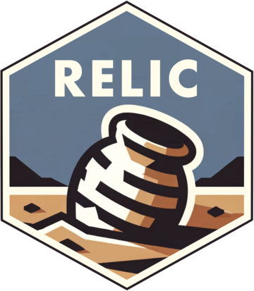

<!-- README.md is generated from README.Rmd. Please edit that file -->

```{r, include = FALSE}
knitr::opts_chunk$set(
  collapse = TRUE,
  comment = "#>",
  fig.path = "man/figures/README-",
  out.width = "100%"
)
```

# relic: objects from history 

<!-- badges: start -->
[](https://lifecycle.r-lib.org/articles/stages.html#experimental)
[](https://github.com/ecohealthalliance/relic/actions/workflows/R-CMD-check.yaml)
[](https://github.com/ecohealthalliance/relic/actions?query=workflow%3Apkgcheck)
[](https://codecov.io/gh/ecohealthalliance/relic)
[](https://ecohealthalliance.r-universe.dev/relic)
[](https://CRAN.R-project.org/package=relic)
<!-- badges: end -->

> _And deeper than oblivion we do bury_  <br />
> _The incensing relics of it_  <br />
> William Shakespeare, [All's Well That Ends Well, V.3](https://internetshakespeare.uvic.ca/doc/AWW_M/scene/5.3/index.html)

The `relic` package provides tools for working with version-controlled workflows,
in git repositories. It enables extracting and comparing files and objects from project history.
You can use `relic` for tasks such as

  - Pulling a file from a previous version of your code
  - Creating a report (or a GIF!) that shows the evolution of a model object or output over
    the course of repository development
  - Run code repeatedly at many points along repository history to compare outputs
    or performance.

`relic` has specific functionality for working with [`targets`](https://books.ropensci.org/targets-manual) projects. It works
especially well when used in conjunction with [cloud-based, versioned object storage](https://books.ropensci.org/targets/cloud-storage.html).

## Installation

You can install the development version of `relic` like so:

```r
install.packages("relic", repos = c("https://ecohealthalliance.r-universe.dev"))
```


## Related work

 - [`git2r`](https://github.com/ropensci/git2r) is a low-level R interface to git, and is used by `relic`.
 - [`gert`](https://github.com/r-lib/gert) is an alternative, higher-level R interface to git especially suited to performing and automating git operations.
 - [`gittargets`](https://github.com/ropensci/gittargets) is an R package for versioning objects in the `targets` framework by placing binary objects in a separate git or Git LFS repository.
 - [`git2rdata`](https://github.com/ropensci/git2rdata/) is an R package for organizing tabular data to store in git repositories.
 - [`git2net`](https://github.com/gotec/git2net) is a Python package that facilitates network analysis of git repositories.
 - [`bisectr`](https://github.com/wch/bisectr) is an R package for running `git bisect` to find commits that introduced bugs in project history.
 - [`dolt`](https:://dolthub.com) is a relational database with git-like versioning and [doltr](https:://github.com/ecohealthalliance/doltr) is an R interface to it.
 
Find more related packages on [R-Universe](https://r-universe.dev/search/?q=git).

## Code of Conduct
  
Please note that the relic project is released with a [Contributor Code of Conduct](https://contributor-covenant.org/version/2/1/CODE_OF_CONDUCT.html). By contributing to this project, you agree to abide by its terms.

`relic` is developed at [EcoHealth Alliance](https://www.ecohealthalliance.org/). 

[](https://www.ecohealthalliance.org/)

